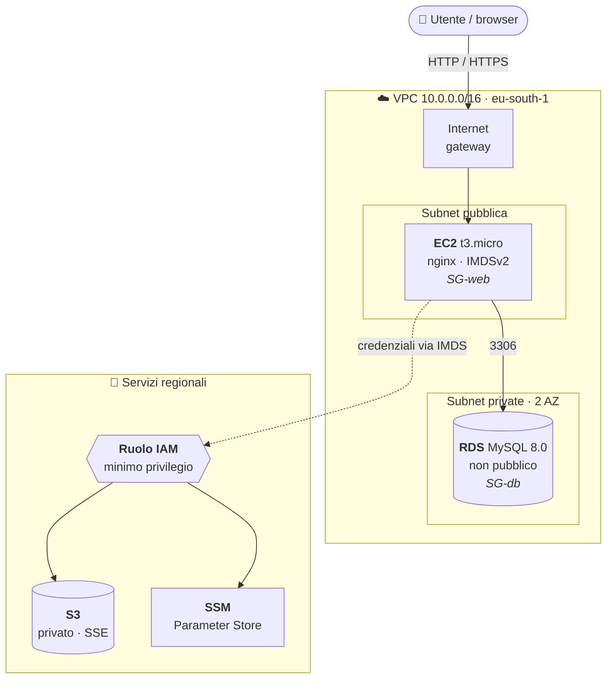

# aws-lab — EC2 + RDS + S3 con Terraform (Floci o AWS reale)

Scenario da laboratorio per fare pratica dopo l'AWS Cloud Practitioner:



| Componente | Regole chiave |
|---|---|
| **SG-web** | 80/443 da tutti · 22 solo da `my_ip` · egress libero |
| **SG-db** | 3306 solo dal security group SG-web (non da un CIDR) |
| **Route table pubblica** | `0.0.0.0/0 → Internet gateway` |
| **Route table privata** | solo `local`: nessuna uscita, nessun NAT gateway |
| **Ruolo IAM** | `s3:Get/Put/DeleteObject` sul bucket · `ssm:GetParameter` su `/aws-lab/*` |

Tutte le risorse hanno il tag `Project=aws-lab`.

Lo stesso codice gira su **Floci** (emulatore locale, gratis) e su **AWS reale** (Free plan).
Il target è il **workspace Terraform**: ogni target ha il suo state, quindi non puoi
applicare per sbaglio su AWS quello che hai creato su Floci.

| File | Contenuto |
|---|---|
| `providers.tf` | provider AWS, switch Floci/AWS in base al workspace |
| `network.tf` | VPC, subnet pubblica + 2 private, IGW, route table, S3 endpoint opzionale |
| `security.tf` | SG-web (80/443 pubblici, 22 solo dal tuo IP), SG-db (3306 solo da SG-web) |
| `iam.tf` | ruolo EC2 a minimo privilegio, Session Manager, instance profile |
| `compute.tf` | key pair, istanza EC2 (IMDSv2, gp3 cifrato) |
| `user_data.sh.tftpl` | bootstrap: nginx, Node, client MySQL, script `lab-check` |
| `database.tf` | DB subnet group + RDS MySQL 8.0 Single-AZ |
| `storage.tf` | bucket S3 con public access block, SSE, versioning |
| `ssm.tf` | password generata e salvata come SecureString |
| `budget.tf` | alert di spesa (solo AWS) |

---

## 0. Preparazione

> Esegui **tutto da utente normale, mai con `sudo`**. Terraform parla con Floci via HTTP
> e non ha bisogno di root. Con `sudo` la `~` diventa `/root`: Terraform cerca la chiave
> in `/root/.ssh/` e i file in `.terraform/` restano di proprietà di root.

```bash
# Chiave SSH (se ~/.ssh/id_ed25519.pub non esiste già)
ssh-keygen -t ed25519 -C "aws-lab"

# Variabili personali
cp terraform.tfvars.example terraform.tfvars
# modifica my_ip (curl -s https://checkip.amazonaws.com), chiave SSH, email

terraform init
```

Per `docker ps` senza sudo serve essere nel gruppo `docker`: dopo `usermod -aG docker`
esci e rientra dalla sessione (oppure `newgrp docker`).

## 1. Su Floci

```bash
terraform workspace select -or-create floci
terraform plan
terraform apply
```

Il primo `apply` è più lento: Floci scarica le immagini `mysql:8.0` e `amazonlinux:2023`.

Cosa verificare:

```bash
docker ps                                   # EC2 e RDS sono container veri
aws --profile floci ec2 describe-instances --query 'Reservations[].Instances[].[InstanceId,State.Name]'
aws --profile floci rds describe-db-instances --query 'DBInstances[].[DBInstanceIdentifier,Endpoint.Address,Endpoint.Port]'
aws --profile floci s3 ls
aws --profile floci ssm get-parameter --name /aws-lab/db/password --with-decryption

# Entra nell'"istanza" (l'immagine amazonlinux:2023 non ha sshd: usa docker exec)
docker exec -it <container-ec2> bash
cat /var/lib/user-data.sh        # lo user_data ricevuto
lab-check                        # SSM + RDS + S3 col ruolo IAM, se il bootstrap è andato a buon fine
```

Floci pubblica le porte aperte a un CIDR nei SG (qui 80 e 443) su porte alte del
host (30000+): la mappatura è nei log, `docker logs floci | grep Published`.

Alla fine: `terraform destroy`.

### Limiti di Floci da tenere a mente

- **Security group**: di default sono solo metadati, il traffico tra container passa
  comunque. Floci ha un'opzione sperimentale per filtrarlo davvero
  (`FLOCI_NETWORK_SECURITY_GROUP_ENFORCEMENT_ENABLED=true` nel compose, richiede Docker
  non rootless): con quella, togliere `db_from_web` dovrebbe bloccare la 3306 anche in locale.
- **Route table / NAT / NACL**: non vengono emulate. "Da internet non entri in RDS" si
  verifica solo su AWS.
- **IMDSv2**: Floci accetta anche richieste senza token, AWS no.
- **systemd**: il container non ce l'ha, per questo lo user_data avvia nginx a mano.
- **AMI**: su Floci si usa l'ID di catalogo `ami-0abcdef1234567891` (Amazon Linux 2023).
  Gli alias tipo `ami-amazonlinux2023` funzionano con `run-instances` ma non con
  `describe-images`, che il provider Terraform chiama prima di creare l'istanza.
  Gli ID disponibili: `aws --profile floci ec2 describe-images --query 'Images[].[ImageId,Name]'`.

### Problemi già incontrati

| Errore | Causa | Soluzione |
|---|---|---|
| `no file exists at "/root/.ssh/id_ed25519.pub"` | Terraform lanciato con `sudo` | `sudo chown -R $USER:$USER ~/aws-lab` e rilancia senza sudo |
| `no file exists at "/home/<utente>/.ssh/id_ed25519.pub"` | Chiave SSH mai generata | `ssh-keygen -t ed25519`, oppure `ssh_public_key_path` in `terraform.tfvars` |
| `var.my_ip  Enter a value:` | Manca `terraform.tfvars` | `cp terraform.tfvars.example terraform.tfvars` e compilalo |
| `aws_instance.web: collecting instance settings: couldn't find resource` | AMI indicata con un alias che `describe-images` non conosce | Usa un ID di catalogo (vedi sopra); l'errore arriva prima di `RunInstances`, quindi basta rilanciare `apply` |
| `permission denied ... docker.sock` | Utente non ancora nel gruppo `docker` in questa sessione | Esci e rientra, oppure `newgrp docker` |

## 2. Su AWS reale

Una tantum:

1. Crea l'account scegliendo il **Free plan** (nessun addebito; scade a 6 mesi o a
   crediti finiti).
2. Attiva l'**MFA sull'utente root** e non usarlo più.
3. Crea un utente IAM (o meglio IAM Identity Center) per Terraform e configura il profilo:
   `aws configure --profile lab` (o `aws configure sso --profile lab`).
4. Imposta `budget_email` in `terraform.tfvars`.

Poi:

```bash
terraform workspace select -or-create aws
terraform plan          # leggilo tutto: una trentina di risorse, nessun NAT gateway
terraform apply         # RDS impiega 5-10 minuti
```

Verifiche:

```bash
IP=$(terraform output -raw web_public_ip)
curl -I http://$IP                                 # 200 da nginx
ssh ec2-user@$IP                                   # funziona solo dal tuo IP
ssh ec2-user@$IP sudo tail -n 20 /var/log/cloud-init-output.log
ssh ec2-user@$IP lab-check                         # ruolo IAM -> SSM -> RDS -> S3

RDS=$(terraform output -raw rds_endpoint)
dig +short $RDS                                    # deve essere un 10.0.x.x
nc -zv -w 5 $RDS 3306                              # dal tuo PC: TIMEOUT (non "refused")

$(terraform output -raw ssm_session_command)       # Session Manager, serve il plugin SSM
```

**Sempre, a fine sessione:** `terraform destroy`. Una sessione di un paio d'ore costa
centesimi di crediti; un RDS dimenticato acceso per settimane no.

---

## 3. Esercizi "rompi e ripara"

Ognuno: prevedi cosa succede, applica, osserva, spiega, ripristina.

1. **Egress mancante** — commenta `web_all_out` in `security.tf`, ricrea l'istanza
   (`terraform apply -replace=aws_instance.web`). Dove lo vedi che il bootstrap è fallito?
2. **SG concatenati** — togli `db_from_web`: `lab-check` va in timeout. Rimettila con
   `cidr_ipv4 = "10.0.1.0/24"` al posto del SG: funziona di nuovo. Cosa cambia se
   aggiungi una seconda istanza nella stessa subnet ma con un altro SG?
3. **Subnet privata che non è privata** — aggiungi alla `aws_route_table.private` una rotta
   `0.0.0.0/0` verso l'IGW. RDS diventa raggiungibile da internet? (Suggerimento:
   `publicly_accessible`.) Quanti livelli di difesa ti restano?
4. **IP sbagliato** — metti un `my_ip` qualunque: SSH in timeout, il sito sulla 80 funziona.
5. **Minimo privilegio** — togli `s3:PutObject` dalla policy: quale riga di `lab-check`
   fallisce e con quale errore? Poi prova a leggere un altro bucket dall'istanza.
6. **Niente SSH** — togli la regola 22 e `key_name`: entri lo stesso con Session Manager.
7. **S3 endpoint** — `-var enable_s3_endpoint=true`, poi guarda la route table pubblica:
   cosa è comparso? Perché in un'architettura con NAT gateway farebbe risparmiare?
8. **IMDSv1** — dall'istanza, `curl http://169.254.169.254/latest/meta-data/` senza token:
   su AWS risponde 401. Perché è importante?

## 4. Evoluzioni possibili

- App Node che legge da RDS e carica file su S3 (al posto della pagina statica)
- State remoto su S3 con lock (`use_lockfile = true`)
- Moduli (`modules/network`, `modules/app`) e variabili per ambienti `dev`/`prod`
- Application Load Balancer + Auto Scaling group (attenzione: l'ALB ha un costo orario)
- Pipeline GitHub Actions: `fmt` + `validate` + `tflint` + `plan` sulle PR

## Note di sicurezza

- Lo **state contiene la password del DB** in chiaro: `.gitignore` lo esclude, non
  committarlo mai. Va bene committare `.terraform.lock.hcl`.
- Su Floci le credenziali sono fittizie (`test`/`test`); su AWS non mettere mai access key
  nel codice: usa i profili della CLI o SSO.
